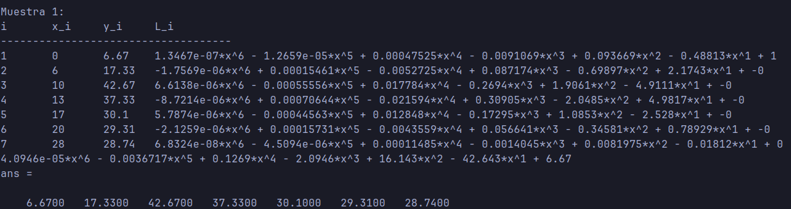
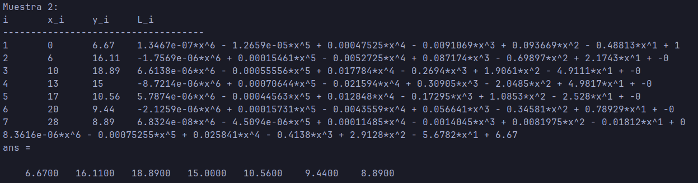
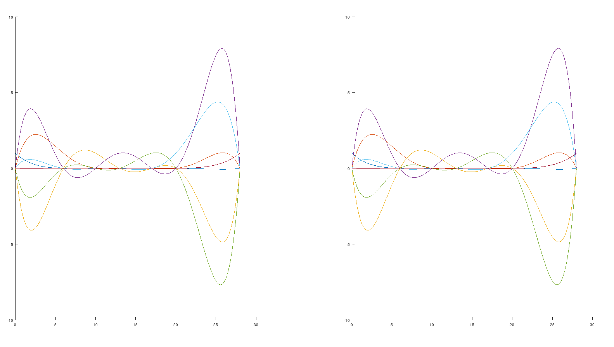

# Ejercicio 1

## Resultados

### Resultado a

La primera parte del programa calcula los polinomios base de Lagrange y su respectivo polinomio interpolador para las dos muestras.

$~$

##

###

##

### Resultado b

La segunda parte muestra las gráficas de los polinomios interpoladores para ambas muestras.

{width=70%}

##

### Resultado c

La tercera parte calcula el máximo aproximado de los polinomios interpoladores en el dominio [0, 28].

##

### Resultado d

Finalmente, el programa grafica los polinomios base de Lagrange para cada caso.

{width=70%}

