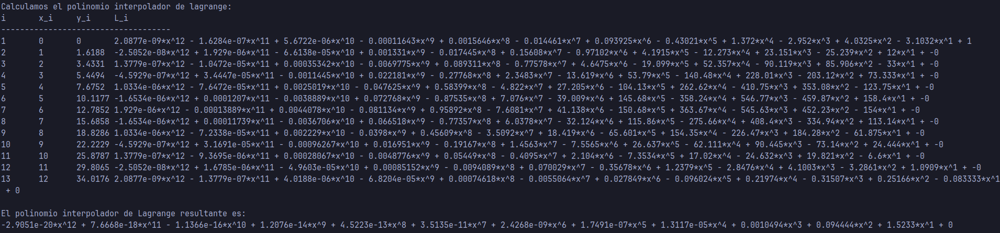
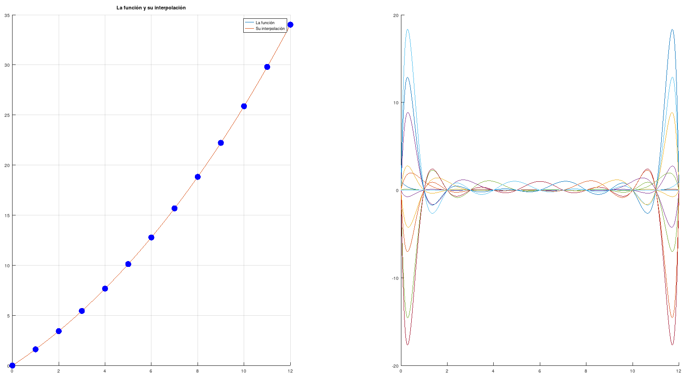

# Ejercicio 2

## Resultados

### Resultado a

La primera parte del programa calcula los polinomios base de Lagrange y su respectivo polinomio interpolador.

$~$

##

### Resultado b

La segunda parte aproxima el instante donde la velocidad es 11.2 m/s usando el polinomio interpolador.

##

### Resultado c

Finalmente, el programa grafica el polinomio interpolador y sus respectivos polinomios base.

{width=70%}

