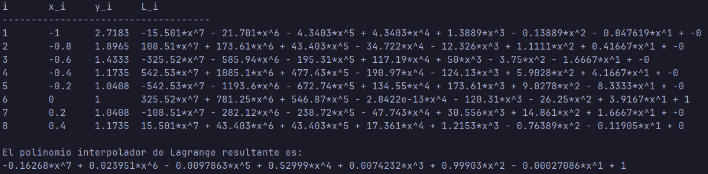
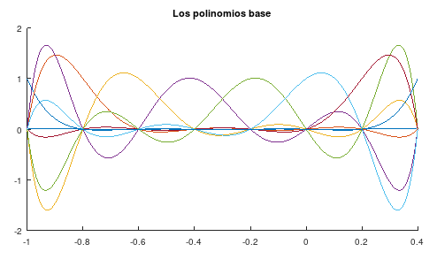
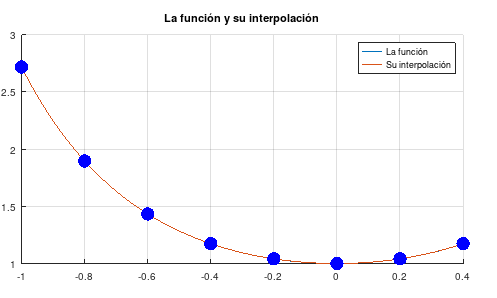
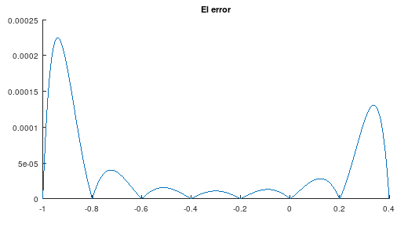

# Ejercicio 1

## Resultados

### Resultado a

La primera parte del programa calcula los polinomios base de Lagrange y su respectivo polinomio interpolador.

$~$

##

### Resultado b

La segunda parte grafica los polinomios base de Lagrange en una misma ventana.

{width=70%}

##

### Resultado c

Luego, el programa grafica la función junto a su interpolación.

{width=70%}

##

### Resultado d

Finalmente, el programa grafica el error absoluto.

{width=70%}

