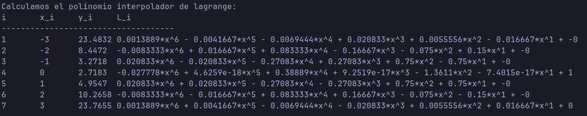
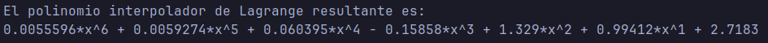
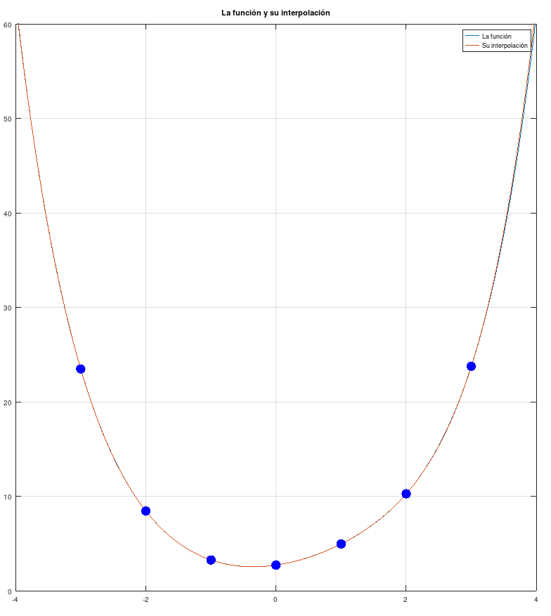
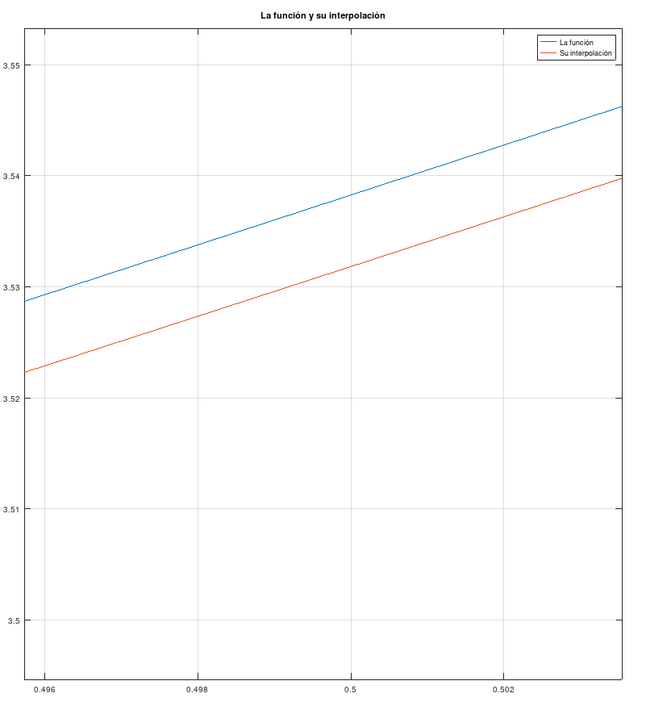
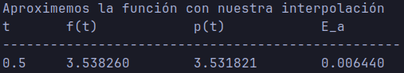

# Ejercicio 1

### Enunciado

Dada la función $f(x)=\sin(x)+\exp(\sqrt{x^2+1})$ y el soporte $\{-3, -2, -1, 0, 1, 2, 3\}$, calcular:

a. Los polinomios base de Lagrange
a. El polinomio interpolador de Lagrange
a. Graficar en una misma gráfica $f(x)$ y su polinomio interpolador, indicando los nodos
a. Aproximar el valor de $f(1/2)$ (halle $p(1/2)$) y determine el error absoluto

### Desarrollo

Usando la teoría, escribiremos un programa en octave para resolver los puntos propuestos.
Primero crearemos una función para calcular el polinomio interpolador de Lagrange. Luego,
usando dicha función, el programa principal.

## El programa

### La función

```octave
% X es un vector que contiene la lista de abscisas
% Y es un vector que contiene la lista de ordenadas
% C es el vector que representa al polinomio interpolador de Lagrange
function C = lagrange(X, Y)
    n = length(X);
    L = zeros(n,n);
    % Calculamos los polinomios base de Lagrange
    disp("i\tx_i\ty_i\tL_i")
    disp("------------------------------------")
    for i = 1:n
        % Calculamos el polinomio base usando la productoria
        V = 1;
```

##

###

```octave
        for j = 1:n
            if j ~= i
                V = conv(V, poly(X(j)))/(X(i)-X(j));
            end
        end
        % Imprimimos el polinomio base calculado
        disp([num2str(i), "\t", num2str(X(i)), "\t", num2str(Y(i)), ...
            "\t", polyout(V, 'x')]);
        % Asignamos nuestro resultado a la i-esima fila de la matriz L
        L(i,:) = V;
    end
    % Finalmente multiplicamos los polinomios a sus respectivas ordenadas
    C = Y*L;
end
```

##

### El programa principal

```octave
function main()
    % Los datos
    f = @(x) sin(x)+exp(sqrt(x.^2+1)); % La funcion
    X = [-3, -2, -1, 0, 1, 2, 3]; % El soporte
    T = [1/2]; % Los valores de prueba
    
    % El procedimiento
    Y = f(X);

    % Punto a
    disp("Calculamos el polinomio interpolador de lagrange:");
    C = lagrange(X, Y);
```

##

###

```octave
    % Punto b
    disp("\nEl polinomio interpolador de Lagrange resultante es:");
    polyout(C, 'x');
    
    % Punto c
    disp("\nGrafiquemos la función y su interpolación:");
    I = min(X)-1:0.0001:max(X)+1;
    plot(I, f(I));
    hold on;
    plot(I, polyval(C, I));
    scatter(X, Y, 100, 'b', 'filled');
    hold off;
    ylim([0 60]);
    grid on;
    legend('La función', 'Su interpolación');
    title("La función y su interpolación");
```

##

###

```octave
    % Punto d
    disp("\nAproximemos la función con nuestra interpolación");
    disp("t\tf(t)\t\tp(t)\t\tE_a");
    disp("--------------------------------------------------");
    for t = T
        ft = f(t);
        pt = polyval(C, t);
        ea = ft - pt;
        disp([num2str(t), "\t", num2str(ft, "%.6f"), "\t", ...
            num2str(pt, "%.6f"), "\t", num2str(ea, "%.6f")]);
    end
end
```

## Resultados

### Resultado a

La primera parte del programa calcula los polinomios base de Lagrange.

$~$



##

### Resultados b

La segunda parte calcula el polinomio interpolador de Lagrange, multiplicando las bases
con sus respectivas ordenadas.



##

### Resultados c

La tercera parte grafica la función inicial junto a su interpolación. A simple vista pareciese
que ambas gráficas coinciden exactamente.

{width=30%}

##

###

Sin embargo, si hacemos zoom en la gráfica notamos que en realidad no coinciden exactamente, sino
que difieren en una magnitud muy pequeña en el intervalo $[-4, +4]$

{width=35%}

##

### Resultados d

Finalmente, el programa nos muestra el error absoluto entre la función y nuestra interpolación
en el punto $t = 1/2$. Notamos que es una magnitud pequeña ($<0.01$)



